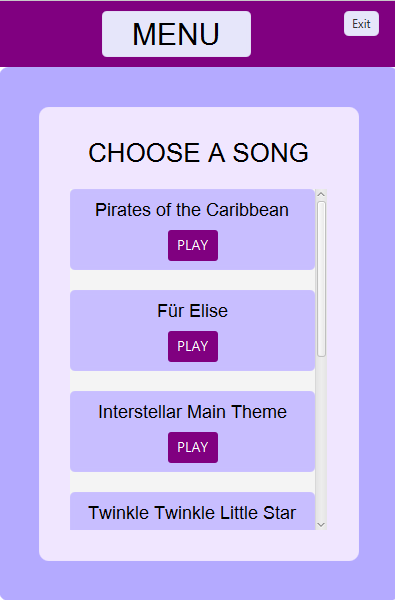
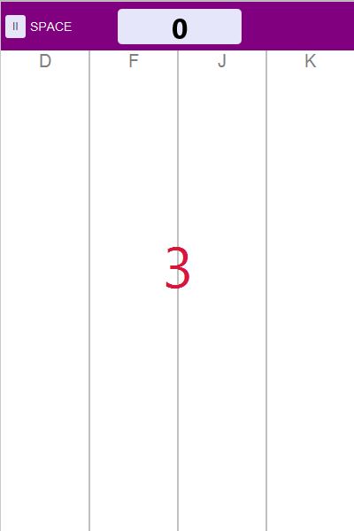
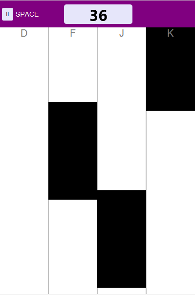
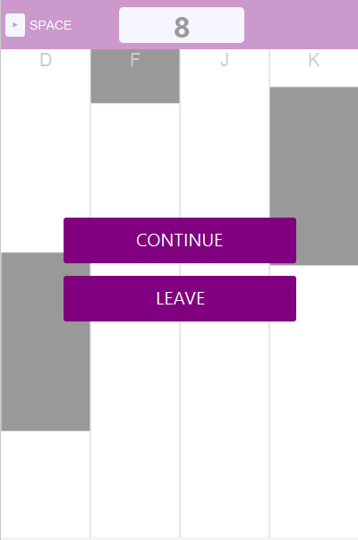
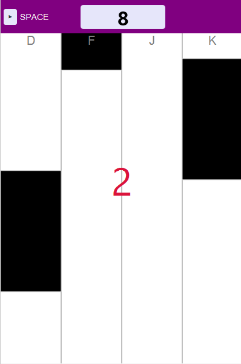
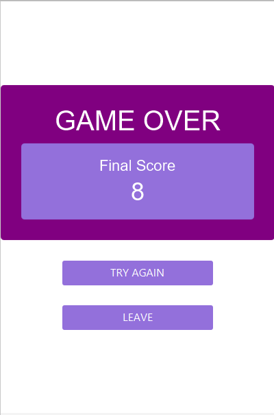

# 🎹 Piano Tiles (JavaFX)

📚 **Studienprojekt** im Kurs *Developer Tools des SE*  
🎓 Studiengang: Software Engineering  

---

## 🧠 Projektidee
Ein Nachbau des bekannten Mobile-Games **„Piano Tiles“**, umgesetzt in **JavaFX**, um objektorientierte Programmierung, Event Handling und UI-Design praktisch anzuwenden.  
Das Projekt wurde als Gruppenarbeit durchgeführt, wobei ich **die Hauptentwicklung übernommen habe**.

---

## 👥 Rolle im Team
Dieses Projekt wurde als Gruppenarbeit im Rahmen eines Hochschulkurses umgesetzt.  
**Meine Aufgaben:**
- Eigenständige Implementierung der Spiellogik (`components/`)  
- Steuerung und Event Handling (`javafx/`)  
- Integration der MIDI-Songs und Tastatursteuerung  
- Umsetzung der Features wie Pause, Countdown und dynamische Spielgeschwindigkeit  
- Implementierung von **JUnit-Tests** zur Überprüfung der Spiellogik  

---

## 🎯 Lernziele
- Vertiefung der **Java-Kenntnisse** mit Fokus auf OOP  
- Erstellung einer **grafischen Benutzeroberfläche (UI) mit JavaFX**  
- Umsetzung von **Event Handling**, Input-Verarbeitung und Tastatursteuerung  
- Anwendung von **MVC-Architekturmuster**  
- Strukturierung des Projekts mit **Gradle** und Versionskontrolle mit **Git**  
- Implementierung von **JUnit-Tests** für die Spiellogik  

---

## ⚙️ Features
- Spielgeschwindigkeit erhöht sich **dynamisch mit der Punktzahl**  
- Auswahl aus **7 verschiedenen MIDI-Songs**  
- **Pause-Button**  
- **Start** und **Continue** mit **3-Sekunden-Countdown**  
- Punktestand wird immer **oben angezeigt**  
- **Tastatursteuerung**: D, F, J, K  
- Strukturierte Projektverwaltung mit **Git** und **Gradle**  
- **JUnit-Tests** zur Überprüfung der Spiellogik  

---

## 🏗️ Architektur (MVC)
- **Model:** Spiellogik und Services in `components/`, Interfaces und Enums in `apis/`  
- **View:** UI-Komponenten in `javafx/`  
- **Controller:** Steuerung und Event Handling (GameEventListener, InputHandler) in `javafx/`  

---

## 📸 Screenshots
*(Füge hier deine Bilder ein, z. B. `screenshots/main-menu.png`)*

| Main Menu | Start Screen | Game Screen |
|-----------|--------------|------------|
|  |  |  |

| Pause Screen | Continue Screen | Game Over Screen |
|--------------|----------------|----------------|
|  |  |  |

---

## 🎥 Video-Demo
🎬 [Hier klicken, um die Demo zu sehen](https://youtu.be/DEIN_VIDEO_LINK)

---

## 💬 Persönliche Reflexion
> Durch dieses Projekt konnte ich meine JavaFX- und Java-Kenntnisse vertiefen, insbesondere im Bereich Event-Handling, Tastatursteuerung und modulare UI-Gestaltung.  
> Ich habe gelernt, wie wichtig saubere Architektur, Code-Struktur und modulare Programmierung für komplexe Softwareprojekte sind.  
> Außerdem konnte ich die Testabdeckung der Spiellogik mit **JUnit** erhöhen und die Projektorganisation über **Gradle** und **Git** professionalisieren.

---

## 👨‍💻 Autor
**Abdulbaki Cakir**  
Student im Studiengang Software Engineering  
